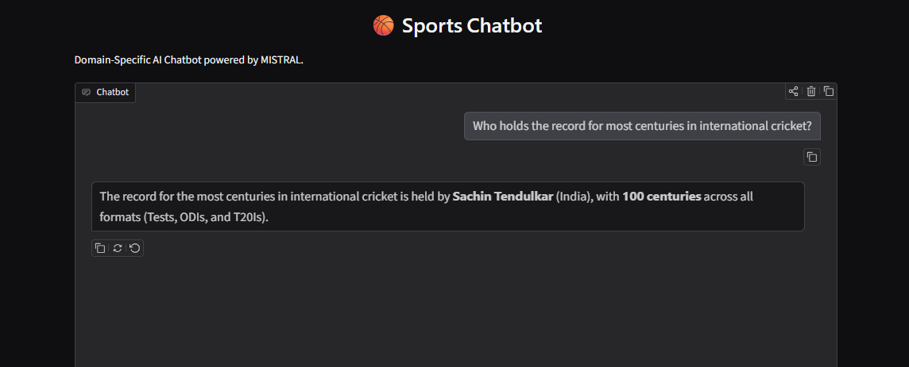
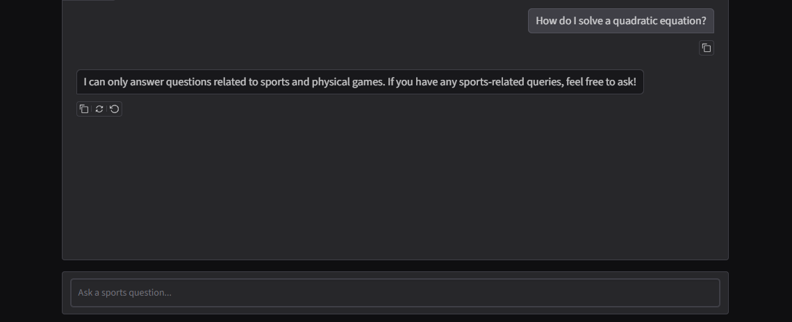

# 🏀 Sport Insight Chatbot

[Open in Google Colab](https://colab.research.google.com/drive/1cJwB0Y9nEvgePSRdD9W-82bts8OINkyJ1?usp=sharing)

A domain-restricted AI chatbot built with **Mistral AI** and **Gradio** designed to answer sports and athletics queries.

## 📱 Interface Preview




## ✨ Features
* **Strict Domain Guardrails:** Rejects non-sports queries (math, general coding, etc.) cleanly.
* **Customizable Parameters:** Interactive sliders for Temperature, Max New Tokens, and Top-P.
* **Example Prompts:** Pre-configured test questions built directly into the UI.

## 🚀 How to Run Locally

1. Clone the repository:
   ```bash
   git clone [https://github.com/nirajkumartakk123-alt/Sport-Insight-Chatbot.git](https://github.com/nirajkumartakk123-alt/Sport-Insight-Chatbot.git)
   cd Sport-Insight-Chatbot
